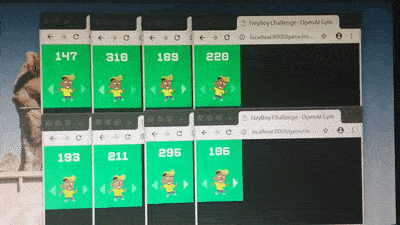

## Training an agent to play "Neyboy Challenge" using [OpenAI Baselines PPO implementation](https://blog.openai.com/openai-baselines-ppo/)


```bash
export GYM_NEYBOY_GAME_URL=https://fabito.github.com/neyboy/game/mindex.html && \
export GYM_NEYBOY_ENV_NON_HEADLESS=1 && \
python -m neyboy.baselines.run \
        --output-dir /tmp/neyboy_challenge/ \
        --num-workers 8 \
        --lr 2e-4 \
        --max-lr 5e-4 \
        --frame-skip 1 \
        --buffer-size 4096 \
        --batch-size 512 \
        --num-epoch 9  \
        --num-timesteps 1000000 \
        --env neyboy-v0
```

## Watching the Agent play

```bash
export GYM_NEYBOY_GAME_URL=https://fabito.github.com/neyboy/game/mindex.html && \
export GYM_NEYBOY_SHUFFLE_TOASTS=off && \
export GYM_NEYBOY_ENV_NON_HEADLESS=1 && \
python -m neyboy.baselines.enjoy \
        --load-path /tmp/neyboy_challenge/checkpoints/00268  \
        --num-episodes 5 \
        --no-render
```